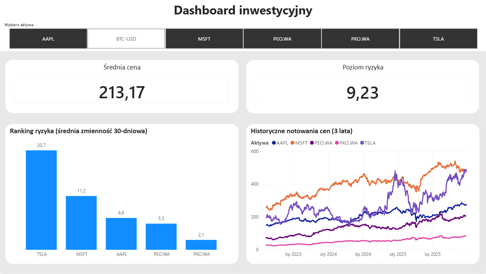

# Market Trends & Risk Analyzer

Profesjonalny dashboard analityczny monitorujący ryzyko rynkowe i zmienność (Volatility) dla akcji (GPW, NASDAQ) oraz kryptowalut. Projekt łączy automatyzację w Pythonie z zaawansowaną wizualizacją w Power BI.



## O Projekcie

Celem projektu było stworzenie narzędzia dla analityka ryzyka, które pozwala błyskawicznie ocenić ekspozycję portfela inwestycyjnego. System rozwiązuje problem ręcznego pobierania danych i żmudnego liczenia odchylenia standardowego w Excelu.

**Kluczowe funkcjonalności:**
* **Automatyczny ETL:** Skrypt pobiera dane historyczne z 3 lat (Yahoo Finance API).
* **Analiza Statystyczna:** Obliczanie 30-dniowej zmienności (wskaźnik ryzyka).
* **Data Cleaning:** Obsługa brakujących danych, scalanie źródeł, formatowanie typów.
* **Interaktywny Dashboard:** Porównanie aktywów o różnej skali (Bitcoin vs PKO BP).

## Technologie i Narzędzia

| Kategoria | Technologie | Zastosowanie |
|-----------|------------|--------------|
| **Backend / ETL** | Python 3.10+ | Główny język skryptowy |
| **Biblioteki** | `pandas`, `yfinance` | Manipulacja danymi (Dataframes), API |
| **Wizualizacja** | Microsoft Power BI | Dashboard, Power Query, DAX |
| **Kontrola Wersji** | Git & GitHub | Zarządzanie kodem |

## Jak to działa? (Architektura)

1.  **Extract (Pobranie):** Skrypt `data_engine.py` łączy się z API giełdowym.
2.  **Transform (Przetwarzanie):**
    * Pandas czyści dane i usuwa błędy.
    * Obliczana jest średnia krocząca i odchylenie standardowe.
    * Dane są "spłaszczane" do formatu czytelnego dla BI.
3.  **Load (Załadowanie):** Gotowy plik `market_data.csv` jest importowany do Power BI.

## Instrukcja uruchomienia

1.  **Sklonowanie repozytorium:**
    ```bash
    git clone [https://github.com/](https://github.com/)WiktoriaDomanska/Market-Analysis-Project.git
    ```
2.  **Instalacja wymaganych bibliotek:**
    ```bash
    pip install pandas yfinance
    ```
3.  **Uruchomienie silnika danych:**
    ```bash
    python data_engine.py
    ```
    *(Spowoduje to wygenerowanie świeżego pliku `market_data.csv`)*.

4.  **Otwarcie raportu:**
    Uruchom plik `Market_Dashboard.pbix` w Power BI Desktop i kliknij "Odśwież".

---

*Autor: Wiktoria Domańska*


